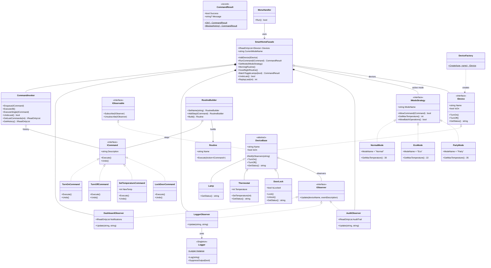
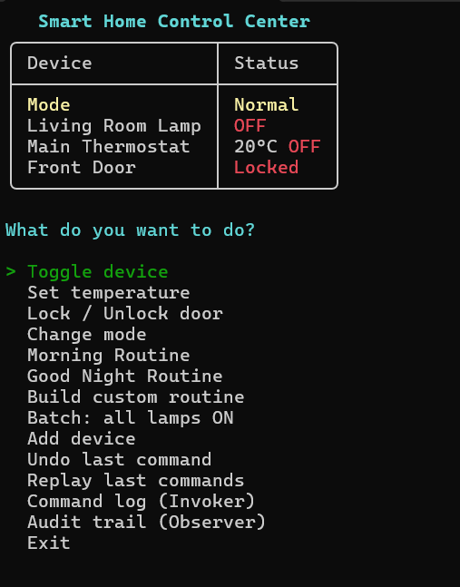

<div align="center">

[](#)
[](#)
[](#)
[](#)

<br/>

En interaktiv konsollapplikation som simulerar ett smart hem-system.<br/>
Byggt med **7 designmönster** och **Spectre.Console** for modernt terminalbaserat UI med pilnavigering och validering.

</div>

<br/>

## &nbsp;Kör programmet

```bash
cd SmartHomeHub
dotnet run
```

> [!NOTE]
> Kräver .NET 10 SDK. Appen startar med 3 enheter: Lamp, Termostat och Dörrlås.

<br/>

## &nbsp;Projektstruktur

```
SmartHomeHub/
├── Interfaces/          # Kontrakt (IDevice, ICommand, IObserver, IModeStrategy)
├── Devices/             # Lamp, Thermostat, DoorLock + gemensam DeviceBase
├── Commands/            # TurnOnCommand, TurnOffCommand, SetTemperatureCommand, LockDoorCommand
├── Observers/           # DashboardObserver, LoggerObserver, AuditObserver
├── Strategies/          # EcoMode, NormalMode, PartyMode
├── Services/            # Logger (Singleton), CommandInvoker, DeviceFactory, RoutineBuilder
├── UI/                  # MenuHandler (interaktiv meny), StatusDisplay (enhetsstatus)
├── SmartHomeFacade.cs   # Facade — huvudingång till hela systemet
└── Program.cs           # Startar appen, minimal — delegerar till MenuHandler
```

<br/>

## &nbsp;Designmönster

<table>
<tr>
<td width="50%" valign="top">

### 1. Observer


**Problem:** När en enhet ändrar state behöver flera delar av systemet veta — dashboard, logg, audit — utan att enheten ska känna till dem.

**Lösning:** `DeviceBase` håller en lista av `IObserver`. Vid state-ändring anropas `NotifyObservers()` som meddelar alla prenumeranter. Tre observers med olika ansvar: `DashboardObserver`, `LoggerObserver`, `AuditObserver`.

**Filer:** `Observers/`, `Devices/DeviceBase.cs`

</td>
<td width="50%" valign="top">

### 2. Command


**Problem:** Vi vill kunna köa, logga, ångra och återspela åtgärder — inte bara anropa metoder direkt.

**Lösning:** Varje åtgärd är ett `ICommand`-objekt med `Execute()` och `Undo()`. `CommandInvoker` hanterar köning, historik, undo och replay av senaste N kommandon.

**Filer:** `Commands/`, `Services/CommandInvoker.cs`

</td>
</tr>
<tr>
<td width="50%" valign="top">

### 3. Strategy


**Problem:** Systemet ska bete sig olika beroende på läge (Eco, Normal, Party) utan en massa if-satser.

**Lösning:** `IModeStrategy` definierar regler: tillåtna kommandon, max temperatur, batch-operationer. Facade frågar aktiv strategy innan varje kommando — strategin påverkar kommandon, temperatur och batch.

**Filer:** `Strategies/`, `Interfaces/IModeStrategy.cs`

</td>
<td width="50%" valign="top">

### 4. Facade


**Problem:** UI-lagret ska inte behöva veta om observers, invokers, strategies och deras samspel.

**Lösning:** `SmartHomeFacade` exponerar ett rent API: `RunCommand()`, `SetMode()`, `MorningRoutine()`, `AddDevice()` m.m. Returnerar `CommandResult` med status och felmeddelande.

**Filer:** `SmartHomeFacade.cs`

</td>
</tr>
<tr>
<td width="50%" valign="top">

### 5. Singleton


**Problem:** Loggning ska ske konsekvent överallt, med en enda delad instans.

**Lösning:** `Logger` använder `Lazy<T>` för thread-safe singleton. Används av `LoggerObserver`, `CommandInvoker` och `SmartHomeFacade` — alla delar samma instans.

**Filer:** `Services/Logger.cs`

</td>
<td width="50%" valign="top">

### 6. Factory Method &nbsp;


**Problem:** Vi vill skapa enheter baserat på en sträng utan att anroparen behöver veta vilken konkret klass som skapas.

**Lösning:** `DeviceFactory.Create("lamp", "Kitchen Lamp")` returnerar rätt `IDevice`. Lätt att utöka med nya enhetstyper.

**Filer:** `Services/DeviceFactory.cs`

</td>
</tr>
<tr>
<td colspan="2" align="center" valign="top">

### 7. Builder &nbsp;


**Problem:** Rutiner (sekvenser av kommandon) kan vara komplexa att bygga, och vi vill ha en tydlig, stegvis konstruktion.

**Lösning:** `RoutineBuilder` med fluent API: `.SetName("Movie Night").AddStep(cmd1).AddStep(cmd2).Build()` returnerar en `Routine` som exekveras via Facade.

**Filer:** `Services/RoutineBuilder.cs`

</td>
</tr>
</table>

<br/>

## &nbsp;Klassdiagram



<br/>

## &nbsp;Demo

<div align="center">

</div>

> [!TIP]
> Menyn navigeras med piltangenter. Temperatur och andra input valideras i realtid — felaktiga värden blockeras direkt.

<br/>

## &nbsp;Clean Code

<table>
<tr>
<td width="25%" align="center"><strong>SRP</strong></td>
<td>UI-logik i <code>UI/</code>, affärslogik i Facade/Commands/Services. Ingen Console-output i affärslagret.</td>
</tr>
<tr>
<td align="center"><strong>DRY</strong></td>
<td>Gemensam <code>DeviceBase</code> för observer-hantering, <code>HandleResult()</code> för enhetlig felvisning.</td>
</tr>
<tr>
<td align="center"><strong>Felhantering</strong></td>
<td>try-catch i menyn, <code>CommandResult</code> för kontrollerade felfall, Spectre.Console-validering på alla input.</td>
</tr>
<tr>
<td align="center"><strong>Lager</strong></td>
<td><code>Program → MenuHandler → SmartHomeFacade → Commands/Invoker/Devices</code></td>
</tr>
</table>

<br/>

## &nbsp;Reflektion — När man INTE ska använda mönster

Designmönster är verktyg, inte mål i sig. **Observer** passar vid en-till-många-relationer, men om bara en klass bryr sig om en ändring är ett enkelt metodanrop bättre — mönstret skapar onödig komplexitet. **Singleton** är bekvämt för loggning, men kan göra testning svår och skapa dolda beroenden — i ett större projekt hade jag använt dependency injection istället. **Command** är perfekt när man behöver undo/replay, men för en enkel "byt lampan" utan historik är det overkill.

> [!IMPORTANT]
> Nyckeln är balans: **enklaste lösningen som löser problemet**. Mönster är riktlinjer, inte magi — de ska förenkla, inte imponera.

<br/>

## &nbsp;Författare

<div align="center">

<a href="https://github.com/klasolsson81">

</a>

### Klas Olsson

[](https://klasolsson.se)

<br/>

[](https://klasolsson.se)
[](https://linkedin.com/in/klasolsson81)
[](mailto:klasolsson81@gmail.com)
[](https://github.com/klasolsson81)

</div>


